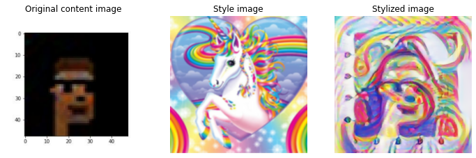

# Project 3 : Generate an NFT with Secret Messages 

## Summary 
This project is a proof of concept for a NFT that can be used to store secret messages within a minted image that is stored on the blockchain as an NFT. The images are generated using a DCGAN model that was trained on a dataset of the famous CryptoPunk NFT's and the messages are encrypted using an AES-256 encryption algorithm. The NFT contract inherits from the ERC721 contract standard.  

Some technologies that will be used are:
- [TensorFlow/PyTorch](https://www.tensorflow.org/) ( GAN Model )
- Streamlit (Front end webapp)
- IPFS Protocol for NFT image storage.
- Steganography to encrypt secret data in the image.
- Ethereum Blockchain Based (For now)

## Project Goals
- Generate 8-bit images based on the user input image. 
- Provide an easy way to mint it to the blockchain. ( using front end webapp )
- Encrypting a user message within the image or a simple hashed version of the message.


## Gif of GAN model generating images based on training data set

Model trained on RTX3070Ti, on full 10k image data set for 500 epochs using Tensorflow


## Example of style transfer to GAN generated image


## Instructions for running the code on your locacl machine
- Install the required dependencies using the command below
```pip install -r requirements.txt```
- [Install Ganache for local testing](www.truffleframework.com/docs/ganache/getting-started)
- Using any online solidity compiler, compile the contract and deploy it to the local Ganache network.
- The contract abi is already provided in the main directory of the project folder. 
- A SAMPLE.env is included in the project folder to access IPFS from [Pianta](https://www.pinata.cloud/)
    - you must paste in your API key and the IPFS endpoint.
    - ensure to copy the deployed contract address from your preferred IDE used to compile the contract. 
- Run the code using the command below
```streamlit run punkApp.py```
- Follow the Demo video to see the app in action and learn how to interact with the app.

## App Demo ! 


## Contributors
- John Gaffney
- Jihad Al Hussain